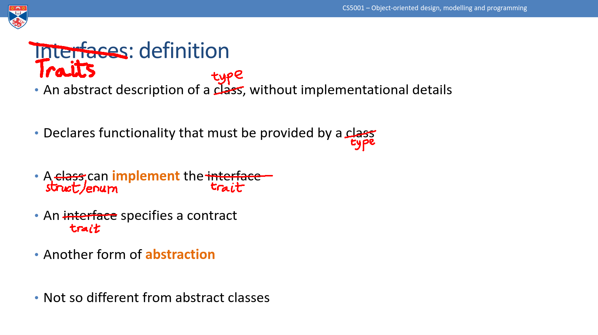

% The Rust Programming Language
% Reading group -- Chapter 10
% Michael Young

# This week

10. Generic Types, Traits, and Lifetimes

    10.1 Generics

    10.2 Traits
    
    10.3 Lifetimes

# 10.1 Generic Data Types

Same as generics in Java

Any questions?

# More detail

- A generic is a parameter for a type
- Allows us to write something abstract that applies to multiple classes
- Without generics:

```rust
fn largest_i32(list: &[i32]) -> &i32 { ... }
fn largest_char(list: &[char]) -> &char { ... }
fn largest_horse(list: &[Horse]) -> &Horse { ... }
```

- With generics:

```rust
fn largest<T>(list: &[T]) -> &T { ... }
```

# Where can we use generics?

- In function definitions
- In struct definitions: `struct Point<T> {x: T, y: T}`
- In enum definitions: `enum Option<T> {Some(T), None}`
- In method definitions (next)

In all cases, same principle: write code once to define behaviour that applies to many types

# Generics in method definitions

- Recall: a method is a function that belongs to an object (i.e. takes `&self` as first arg)
- Generic types can have generic method implementations

```rust
struct Point<T> {x: T, y: T}

// Implement a method for all types T
impl<T> Point<T> {
    fn x(&self) -> &T {
        &self.x
    }
}

// Implement a method for a specific type
impl Point<f32> {
    fn distance_from_origin(&self) -> f32 {
        (self.x.powi(2) + self.y.powi(2)).sqrt()
    }
}
```


# 10.2 Traits: Defining Shared Behavior

Same as interfaces in Java

Any questions?

#



# Even more detail

- Imagine several types implement methods with the same name and signature
- We can make a **trait** that contains that signature, and declare it for all the types
- Then we can write code that applies to *all* classes with the trait

# Example

```rust
pub trait Summary {
    fn summarize(&self) -> String;
}

pub struct NewsArticle { ... }

impl Summary for NewsArticle {
    fn summarize(&self) -> String {
        format!("{}, by {} ({})", self.headline, self.author, self.location)
    }
}

pub struct SocialPost { ... }

impl Summary for SocialPost {
    fn summarize(&self) -> String {
        format!("{}: {}", self.username, self.content)
    }
}
```

# Traits as parameters

- Now we can write a method by specifying a trait *instead of* an explicit type:

```rust
pub fn notify(item: &impl Summary) {
    println!("Breaking news! {}", item.summarize());
}
```

- We don't know or care what type `item` is, so long as it has the `Summary` trait

# Trait bound syntax

- `(item: &impl Summary)` is shorthand for `<T: Summary>(item: &T)`
- We can specify more complex type signatures using this syntax

```rust
fn notify<T: Summary>(item1: &T, item2: &T)  // args must have the same type
fn notify<T: Summary, U: Summary>(t: &T, u: &U)  // args could have different types
fn notify<T: Summary + Display>(item1 &T)  // two traits
```
- If this gets too dense, we can put the trait requirements in a `where` clause


# Default implementations

A trait can just specify a function signature, or give a default implementation
```rust
pub trait Summary {
    fn summarize(&self) -> String;
}

pub trait Summary {
    fn summarize(&self) -> String {
        String::from("(Read more...)")
    }
}
```
- If there's a default, then types with the trait don't need to implement the function
- If there's no default, then types *have to* implement it (the compiler checks)


# 10.3 Validating References with Lifetimes

- Every reference has a **lifetime**
- Usually these are inferred (just like types)
- But when it's ambiguous, we need to annotate it

# Dangling references

- When a program references data it's not intended to reference

```rust
fn main() {
    let r;

    {
        let x = 5;
        r = &x;
    }

    println!("r: {r}");
}
```
- Error: `x` does not live long enough
- We say `r` lives longer than `x`
- Lifetimes!

# Generic lifetime parameters

```rust
fn longest(x: &str, y: &str) -> &str {
    if x.len() > y.len() { x } else { y }
}
```

- "This function's return type contains a borrowed value, but the signature does not say whether it is borrowed from `x` or `y`"
- We don't know the lifetimes of the variables that will be passed in, so we don't know whether returning either `x` or `y` is valid

#

```rust
fn longest<'a>(x: &'a str, y: &'a str) -> &'a str {
    if x.len() > y.len() { x } else { y }
}
```
- We have a lifetime parameter `'a` that applies to both inputs and the output
- Hence both inputs must live at least as long as the output
  - The borrow checker will reject any scoping that doesn't satisfy this!
```rust
fn main() {
    let string1 = String::from("long string is long");
    let result;
    {
        let string2 = String::from("xyz");
        result = longest(string1.as_str(), string2.as_str());
    }
    println!("The longest string is {result}");  // string2 does not live long enough
}
```

# The Static lifetime

- We can declare something with the `'static` lifetime: it lives forever!
- All string literals have this (they are stored in the program binary)
- Overuse of this would be an inappropriate hack

# These also appear in

- Struct definitions: field lives at least as long as the struct
- Method definitions: I'm not quite clear on these!

# How to think about lifetimes

A bit like type inference:

- Compiler checks whether variables live long enough
- Sometimes compiler can't work it out (undecidable in general)
- We **add restrictions** so the compiler can check
- Compiler is getting smarter: fewer annotations might be needed in future

# Everything together: example

```rust
use std::fmt::Display;

fn longest_with_an_announcement<'a, T>(
    x: &'a str,
    y: &'a str,
    ann: T,
) -> &'a str
where
    T: Display,
{
    println!("Announcement! {ann}");
    if x.len() > y.len() { x } else { y }
}
```
