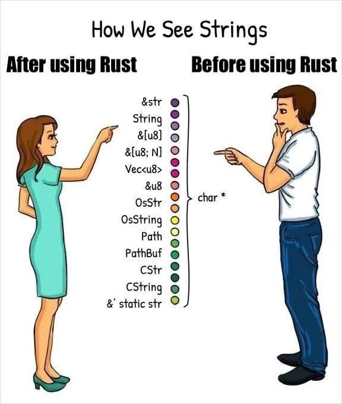

<div class="title">

# Week 3 :)

<i>Slide template taken from Sylvain Wallez' [Rust intro](https://github.com/swallez/introduction-to-rust?tab=readme-ov-file). This is rendered through [Mdbook](https://rust-lang.github.io/mdBook/) (which is how the Rust book is created)</i>. 


</div>

-----------------

# This Weeks Content

-  **Chapter 5 - Using Structs to Structure Related Data**
    - Defining and Instantiating Structs
    - Example Program Using Structs
    - Method Syntax
- **Chapter 6 - Enums and Pattern Matching**
    - Defining an Enum
    - Match program Control Flow Construct
    - Conscise Control Flow with if let and let else
- General thoughts
- Coding example
<center>


</center>

-----------------

## Motivation
We are all pretty busy and its been hard to find time for Rust recently. I felt some motivation may be needed.

By the end of our Rust journey we can confuse everyone with strings




-----------------

## Structs (structures)!

Grouping of related values (kind of like an object). 
Some comparisons I made initally...
| Language     | Equivalent to Rust Structs                        |
|-------------|--------------------------------------------------|
| **C++**     | `struct`, `class` (without methods or with public fields) |
| **Java**    | `record`  |
| **Python**  | `dataclass` (Python 3.7+)? |
| **JavaScript/TypeScript** | Interfaces or object literals (`{}`) |


-----------------

### Defining
State like tuple but we add name : type pairs (hence can be different types).
For example
```rust,editable
// Should this be camel case?
struct CSstudent {
    name: String, // attributes (in OOP)
    email: String,
    coffee_addict: bool,
    total_commits: u64,
}
```

----------------

### Using structs
We create a variable and call the struct but adding concrete values after each name and can call by using attribute notation in other languages like java.

```rust,editable
let student1 = CS_Student {
    // Doesnt need to be in order stated
    name: String::from("Jake"),
    email: String::from("ja250@st-andrews.ac.uk"),
    coffee_addict: true,
    total_commits: 400,
}
// grab attributes like so
let jakes_email = student1.email;

// Test - why would this NOT work?
student1.email = String::from("other0@st-andrews.ac.uk");
```

----------------

### Other neat features when declaring
- Can add pre known attributes (i.e dont need to init them).
    - If param has the same name as attribute dont can use ```attribute``` over ```attribute : attribute``` notation.
- Can reference other structures attributes using the ```..structure_name``` syntax.
    - Is this sort of like inheritance / overriding? 
    - If we have types like u64 or bool that have copy trait would just copy over!

```rust,editable
let student2 = CS_Student {
    name: String::from("julia"),
    email: String::from("julia@st-andrews.ac.uk"),
    ..student1  // take definitions for other attributes from student1
}
```


----------------

### Variations

<b>Tuple structs</b> - values with unnamed attributes (eg we would probally use when value meaning is implied through index). ```struct Color(i32, i32, i32);``` (RGB). Accessed through ```.index``` notation
<i>Any thoughts on other examples where we may use?</i>

<b>Unit-like structs</b> - A struct without attributes (unit). We will learn more on why we may want this when discussing traits ! This will be equal to every other type 🤯

----------------

### OWNERSHIP .......

When defining a struct we use ```String``` over ```&str``` because we want the instances to <i>own</i> all of its data.
Can have cases where struct references data owned by someone else but we need to know about <i>lifetimes</i> :/

We will find out more about this in section 10 (which feels like a <i>lifetime</i> away sadly...)

-----------------

### Example
The docs had an example. There is no point me re stating their example but would be nice to hear peoples peoples thoughts?

An example I thought of was in our Knight-Tour we could potentially have a Position (position on board) struct.

```rust,editable
#[derive(Debug)]
// This by itself is slightly pointless (compared to tuple) 
// ... but will make more sence when we add methods
struct Position {
    x: u8,
    y: u8,
}
```

--------------

### Methods
Intuitively Methods are basically the same as class methods in most OO languages.
We create them by using ```impl``` (can have multiple per struct).
No such thing as getters and setters in Rust.
We use ```object.method()``` notation (dont need -> as rust automatically matches signature of method!).
<i>Associated functions</i> = methods that dont reference struct (i.e dont have self in params). Often use when we want to create new instance of struct.
```rust,editable
impl Position {
    // Check if the position is within the board boundaries
    fn valid(&self) -> bool {   // Using &self as we just want copy of attributes (not ownership)
        (0..WIDTH).contains(&self.x) && (0..WIDTH).contains(&self.y)
    }
```
---------------

## Enums
These are used when defining types to <i>enumerate</i> through its different variants.

These are in other prog languages right? (python / java ect...)

We call then through ```::``` i.e we namespace it up its id.
<i>example</i>
```rust,editable
// From book
enum IpAddrKind {
    V4,
    V6,
}

let four = IpAddrKind::V4;      // double colon for specific kind or single colon for any of that type
```

---------------

### When we use enums over structs?
<ul>
<li>
Say we dont know all attributes in advance only know type.
</li>
<li>
Are able to have different types for variants (cant do this with a struct).
</li>
</ul>

```rust,editable
// their example
enum IpAddr {
        V4(u8, u8, u8, u8),
        V6(String),
    }
```
But from my understanding anything that can be done with an enum can be replicated with multiple structs (obviously a bit longer to express).
We can also use methods with enums (with ```imp```)??? 

---------------

### ```Option``` Enum

Note - I have seen this in quite a lot of rust code so I think this is quite important

Its basically a type where it could be something (i.e not ```null```) or ```null```.

I suppose an example of this would be popping from a stack (to be honest this would probally throw an error before I imagine)?

Why do we need this ? ->
<b> RUST DOESNT HAVE A NULL TYPE ...</b> - What are peoples thoughts on this? 

Option is defined as -
```rust,editable
enum Option<T> {   // we dont need to bring into scope explicitly
    None,       // We can call these directly if we want - if so can we not just think of None as null?
    Some(T), // T is a generic type parameter (we find out about this later) - T can hold any type
}
```

---------------

### Option examples

Rust will infer the type T. 
```rust,editable
    let some_number = Some(5);      // infers i32
    let some_char = Some('e');      // infers char

    let absent_number: Option<i32> = None;  // of type Option<i32> as we dont know what type some would be
```
But we need to note ```Option<T> != T```! meaning we cant do normal type operations with Option if we have defined T with Some(value) (eg cannot add `Option<i8>` to `i8`). To fix this we must covert ```Option<T>``` to ```T``` by ensuring its not null. This means if we see a type that isnt `Option<T>` we know it cant be null! 


---------------

### ```Match``` Control flow construct

A bit like a more powerful version of Switch in Python / Java. 

```rust,editable

// Example they gave - helps us tell what variant of the type it is
enum Coin {
    Penny,
    Nickel,
    Dime,
    Quarter,
}

fn value_in_cents(coin: Coin) -> u8 {
    match coin {
        Coin::Penny => 1,       // These are the arms (have talked about this already)
        Coin::Nickel => 5,
        Coin::Dime => 10,       // for multiline return statements on an arm use => {... u8} notation
        Coin::Quarter => 25,
    }
}
```

---------------

### Matching with ```Option<T>```

The same idea as before but now the arms are ```None``` and ```Some(T)``` as these are the variants of Option.

This is useful for handling when we have the something there and when there isnt, for example we couldnt add `Option<i8>` to `i8` directly because of the ```null``` case so we handle it like so.

```rust,editable
    fn plus_one(x: Option<i32>) -> Option<i32> {
        match x {
            None => None,
            Some(i) => Some(i + 1),
        }
    }

    let five = Some(5);
    let six = plus_one(five);
    let none = plus_one(None);
```


---------------

### Match everything

We must remember if we use ```match``` to handle all variants! eg if we didnt handle the None arm then we would get an error as match is exhaustive! 
Can use ```other``` or ```_``` to catch all other cases (like ```default``` in cases)


---------------

### ```if let``` and ```let else```

Essentially for when we want to do matches on an ```Option<T>``` for example but only care about a certain arm (i.e dont do anything if it doesnt match on said arm).

However - this is means less exhaustive checking but shorter code.

We can replicate the behaviour of ```_``` / ```other``` with ```else``` ->

``` let mut count = 0;
    if let Coin::Quarter(state) = coin {
        println!("State quarter from {state:?}!");
    } else {
        count += 1;
    }
```

---------------

### ```let else``` (happy path)

If the pattern matches go the outer loop but if it doesnt execute whats inside the let else. This is known as the <i>"happy path"</i> as we dont need to change scope to deal with the case of no pattern match.


---------------

### Example

In our knights tour we had -

```rust,editable
match visited.iter().position(|a| a == &(x, y)) {
    Some(i) => print!("{:>3}", i),
    None => print!("  .")
};
```
Given what we have learnt we could use if let instead!
```rust,editable

if let Some(i) = visited.iter().position(|a| a == &(x, y)) {
    print!("{:>3}", i);
} else {
    print!("  .");
}
```

---------------

### Thanks for listening

Time for any questions / other thoughts ...


---------------
